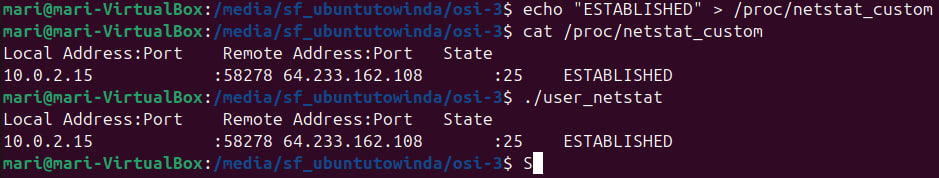
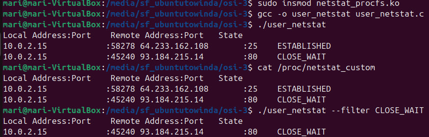

# Лабораторная работа №3

`Толстых Мария P3330`

`Вариант: procfs : netstat`

## Задание

Разработать комплекс программ на пользовательском уровне и уровне ярда, который собирает информацию на стороне ядра и передает информацию на уровень пользователя, и выводит ее в удобном для чтения человеком виде. Программа на уровне пользователя получает на вход аргумент(ы) командной строки (не адрес!), позволяющие идентифицировать из системных таблиц необходимый путь до целевой структуры, осуществляет передачу на уровень ядра, получает информацию из данной структуры и распечатывает структуру в стандартный вывод. Загружаемый модуль ядра принимает запрос через указанный в задании интерфейс, определяет путь до целевой структуры по переданному запросу и возвращает результат на уровень пользователя.

---

## О коде

Код представляет собой реализацию утилиты netstat, работающей с использованием виртуальной файловой системы procfs в Linux. Он состоит из двух частей: модуля ядра для создания специального файла в /proc и пользовательской программы, которая взаимодействует с этим файлом. Модуль ядра отображает информацию о TCP-соединениях, а пользовательская программа позволяет фильтровать результаты по состоянию соединений.

### netstat_procfs

Модуль ядра создает файл /proc/netstat_custom, через который пользователь может запрашивать сетевую информацию о соединениях TCP.
Использует хеш-таблицы ядра для сбора информации о текущих TCP-соединениях.
Поддерживает фильтрацию состояний TCP (например, ESTABLISHED, LISTEN, CLOSE_WAIT).
Основные функции:
netstat_show: Форматирует и выводит данные о TCP-соединениях в файл /proc/netstat_custom.
netstat_write: Обрабатывает запись фильтра состояния TCP, задаваемого пользователем.
netstat_open: Открывает интерфейс /proc для чтения данных.
Фильтрация состояний TCP: Реализована через глобальную переменную filter. Пользователь может указать состояние (например, ESTABLISHED) для фильтрации отображаемых данных.

### user_netstat

Программа взаимодействует с файлом /proc/netstat_custom для получения информации о сетевых соединениях.
Поддерживает установку фильтра через аргументы командной строки (например, --filter ESTABLISHED).
Основные функции:
Чтение данных из /proc/netstat_custom и их вывод в удобном для чтения формате.
Передача фильтра в модуль ядра через запись в файл /proc/netstat_custom.

## Работа программы

## Заключение

Решение демонстрирует взаимодействие между пользователем и ядром Linux через интерфейс /proc, обеспечивая доступ к сетевой информации и гибкость в её фильтрации.